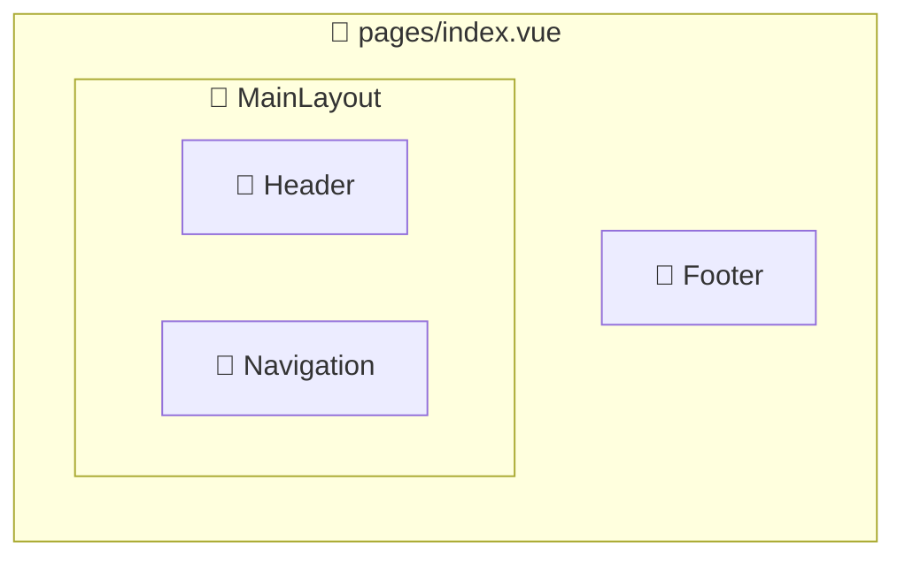

# Mieru (見える)

Advanced component visualization tool for Vue.js, React, Nuxt.js, and Next.js projects. Clean, optimized codebase with intelligent Mermaid diagram generation.

## Overview

見える（Mieru）は、現代のWebフレームワークにおけるコンポーネントとページの関係性を**美しく視覚化**するCLIツールです。

**独自のネストしたsubgraph構造**により、コンポーネント内で使用される子コンポーネントまで階層的に表現。直感的なカラーテーマで、ページ（緑）とコンポーネント（青系濃淡）を区別し、プロジェクトの構造を一目で理解できます。

プロジェクト名を自動抽出してファイル名に使用し、単一のMarkdownファイルで包括的な解析結果を提供します。

### ✨ Features

- 🎯 **Smart Project Name Extraction** - パスから自動的にプロジェクト名を抽出してファイル名に使用
- 📊 **Nested Component Visualization** - ページ内のコンポーネント階層を美しいsubgraph構造で表現
- 🎨 **Color-Coded Architecture** - ページ（緑）・コンポーネント（青）・ネスト構造（濃淡）の直感的な色分け
- 🎯 **Multi-Framework Support** - Vue.js、React、Nuxt.js、Next.jsに対応
- 🌐 **GitHub Integration** - ローカルプロジェクトとGitHubリポジトリ両方に対応
- 📋 **Single Markdown Output** - 統一されたMarkdownレポートで簡潔な結果表示
- 🔍 **Recursive Dependency Analysis** - 最大3階層のコンポーネント依存関係を詳細分析
- ⚡ **Fast Processing** - TypeScript AST解析による高速処理
- 🧹 **Auto Cleanup** - 一時ファイルの自動クリーンアップ
- 🧠 **Optional AI Analysis** - LLM機能はオプション（APIキー不要でも動作）
- 🔐 **Smart API Key Management** - 設定ファイル、CLI引数、環境変数の3段階サポート

### 🚀 Supported Frameworks

- ✅ **Vue.js** - SFC (Single File Components) 完全対応
- ✅ **React** - JSX/TSX コンポーネント解析
- ✅ **Nuxt.js** - ページ構造とコンポーネント関係
- ✅ **Next.js** - App Router / Pages Router 両対応

## 📦 Installation

```bash
# NPMパッケージとしてグローバルインストール（推奨）
npm install -g mieru

# または、プロジェクトローカルにインストール
npm install mieru
```

## 🔧 Usage

### 初回セットアップ

```bash
# 対話式セットアップ（APIキー設定）
mieru setup

# または、APIキーなしで基本機能を使用
mieru analyze ./your-project  # 基本的な解析はAPIキー不要
```

### 基本的な使用方法

```bash
# ローカルプロジェクトを解析
mieru analyze ./your-project

# GitHubリポジトリを解析
mieru analyze https://github.com/username/repository

# 特定のAPIキーを使用
mieru analyze ./project --api-key your-api-key-here
```

### ローカルプロジェクト解析

```bash
# 基本的な解析
mieru analyze /path/to/my-awesome-project
# → analysis-my-awesome-project.md が生成される

# 特定のディレクトリ
mieru analyze /Users/username/projects/vue-todo-app
# → analysis-vue-todo-app.md が生成される
```

### GitHub リポジトリ解析

```bash
# GitHub リポジトリ解析
mieru analyze https://github.com/username/repository
# → analysis-repository.md が生成される

# 特定ブランチ
mieru analyze https://github.com/username/repository/tree/develop
# → analysis-repository.md が生成される

# サブディレクトリ
mieru analyze https://github.com/username/repository/tree/main/frontend
# → analysis-repository.md が生成される
```

### 設定管理

```bash
# 現在の設定を表示
mieru config --show

# 設定をリセット
mieru config --reset

# 再セットアップ
mieru setup
```

## 🔑 API Key Management

Mieruは以下の優先順位でAPIキーを取得します：

1. **CLI引数** - `--api-key` オプション
2. **環境変数** - `OPENAI_API_KEY` または `MIERU_OPENAI_API_KEY`
3. **設定ファイル** - `~/.mierurc.json`

### 設定ファイルの例

```json
{
  "openai": {
    "apiKey": "sk-your-api-key-here"
  },
  "defaultOptions": {
    "outputFormat": "markdown",
    "includeTests": false
  }
}
```

### 環境変数

```bash
# OpenAI APIキーを設定
export OPENAI_API_KEY=sk-your-api-key-here

# または、Mieru専用の環境変数
export MIERU_OPENAI_API_KEY=sk-your-api-key-here
```

### 対話式セットアップ

```bash
mieru setup
```

初回実行時に以下の設定を行います：
- APIキーの入力
- 設定ファイルの作成
- 基本オプションの設定

## 🎨 Visual Features

### カラーテーマ

Mieruは直感的な色分けでプロジェクト構造を視覚化します：

- 🟢 **ページ** - 緑系統（`#E8F5E8` 背景、`#4CAF50` 枠線）
- 🔵 **通常コンポーネント** - 薄青（`#7BB3F0` 背景）
- 🔷 **親コンポーネント** - 中青（`#4A90E2` 背景）
- 🔹 **子コンポーネント** - 濃青（`#2E5A8A` 背景）

### ネストした構造表現

コンポーネント内でさらにコンポーネントが使用されている場合、subgraph構造で階層を表現：

```mermaid
subgraph page1 ["📄 pages/profile.vue"]
  subgraph sidebar ["🧩 ProfileSidebar"]
    search["🧩 SearchForm"]
    menu["🧩 NavigationMenu"]
  end
  content["🧩 ProfileContent"]
end
```

## 🧠 LLM Integration (Optional)

### サポートされるLLMプロバイダー

| プロバイダー | モデル | 用途 | ステータス |
|-------------|--------|------|----------|
| **OpenAI** | GPT-4, GPT-3.5 | コード解析・フレームワーク検出 | ✅ 実装済み |
| **Anthropic** | Claude-3 | 高精度アーキテクチャ分析 | 🔄 計画中 |
| **ローカルLLM** | Ollama等 | プライベート解析 | 🔄 計画中 |

### インテリジェント機能

- **スマートフレームワーク検出**: package.json、ファイル構造、import文からAIが自動判定
- **コンポーネントタイプ分類**: UIコンポーネント、ロジックコンポーネント、ユーティリティの自動分類
- **アーキテクチャパターン識別**: MVC、MVVM、Composition API等のパターン検出
- **信頼度スコア**: 各判定の確度を数値化 (high/medium/low)

## 📊 Output Format

### Page Structure Report (デフォルト)

デフォルトの出力形式で、APIキー不要で動作します：

- **技術スタック解析**: 言語・フレームワーク・ビルドツール・パッケージマネージャーの自動検出
- **ネストしたコンポーネント階層**: subgraph構造でコンポーネントの親子関係を視覚化（最大3階層）
- **カラーコード図表**: 緑（ページ）・青系（コンポーネント）の直感的な色分け
- **統一されたsubgraph**: 空のページも統一感のあるスタイルで表示
- **詳細統計情報**: ページ数・コンポーネント数・解析時間・技術構成
- **GitHub統合**: リポジトリURL、ブランチ、サブディレクトリ対応

**出力例**:
```
analysis-my-project.md  # 単一ファイル出力
```

**レポート内容例**:

```markdown
# ページ構造解析レポート

**生成日時**: 2025/7/12 8:30:45
**参照元**: `/path/to/my-project`

## 🚀 技術スタック

### 主要技術
- **言語**: TypeScript
- **フレームワーク**: Vue.js
- **パッケージマネージャー**: npm

### 言語構成
- **TypeScript**: 75% (45ファイル)
- **JavaScript**: 25% (15ファイル)

### フレームワーク/ライブラリ
- **Vue.js** v^3.0.0 (信頼度: high)
- **Nuxt.js** v^3.0.0 (信頼度: high)

## 🗺️ プロジェクト構造図



## 📊 統計情報

- **総ページ数**: 5
- **総コンポーネント数**: 23
- **平均コンポーネント数/ページ**: 4.6
- **最大ネスト深度**: 3
- **解析時間**: 2.1秒
```

## 🔧 Development

### Local Development

```bash
# リポジトリをクローン
git clone https://github.com/your-username/mieru.git
cd mieru

# 依存関係をインストール
npm install

# ビルド
npm run build

# 開発モードでテスト
npm run dev
```

### Project Structure

```
mieru/
├── src/
│   ├── cli/              # CLI interface
│   ├── analyzer/         # Core analysis logic
│   ├── generators/       # Output generators
│   ├── utils/            # Utilities
│   └── types/            # Type definitions
├── dist/                 # Built files
├── examples/             # Example projects
└── docs/                 # Documentation
```

## 🤝 Contributing

1. Fork the repository
2. Create a feature branch (`git checkout -b feature/amazing-feature`)
3. Commit your changes (`git commit -m 'Add amazing feature'`)
4. Push to the branch (`git push origin feature/amazing-feature`)
5. Open a Pull Request

## 📄 License

This project is licensed under the MIT License - see the [LICENSE](LICENSE) file for details.

## 🙏 Acknowledgments

- [Mermaid](https://mermaid.js.org/) for diagram generation
- [TypeScript](https://www.typescriptlang.org/) for static analysis
- [OpenAI](https://openai.com/) for intelligent analysis features

---

**Made with ❤️ by the Mieru team**
