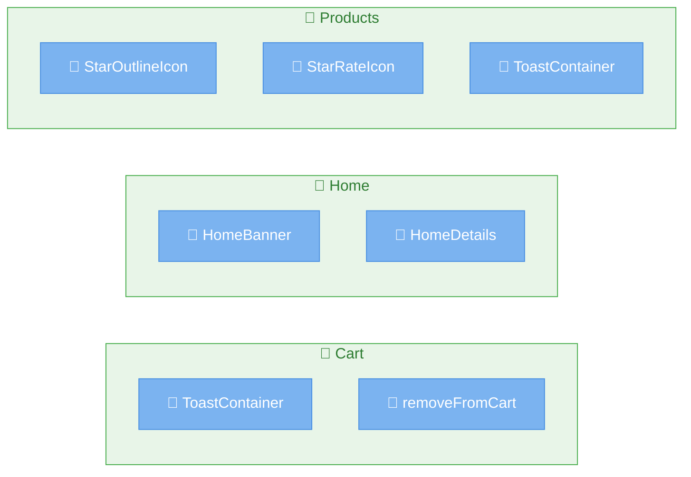

# amazon-clone-tutorial - ページ構造解析レポート

## 📊 プロジェクト概要

- **プロジェクト名**: amazon-clone-tutorial
- **ソース**: https://github.com/mashho/amazon-clone-tutorial
- **フレームワーク**: React (18.3.1)
- **信頼度**: 90%
- **総ファイル数**: 18
- **解析時間**: 9382ms
- **生成日時**: 2025/7/12 9:56:40

## 📄 検出されたページ (3個)

## 🗺️ プロジェクト構造図

### 1. 📄 Cart

- **ファイル**: `src/Screen/Cart/cart.js`
- **ルート**: `/cart`
- **コンポーネント数**: 2個
- **判定理由**: This file represents the Cart page where users can view and manage their selected products.

#### 🧩 使用コンポーネント

- 🧩 **ToastContainer** (component) - `react-toastify`
- 🧩 **removeFromCart** (component) - `../../redux/actions/actions`

### 2. 📄 Home

- **ファイル**: `src/Screen/HomeScreen/homeScreen.js`
- **ルート**: `/`
- **コンポーネント数**: 2個
- **判定理由**: This file represents the Home page, which is typically the landing page of the application.

#### 🧩 使用コンポーネント

- 🧩 **HomeBanner** (component) - `./HomeBanner/homeBanner`
- 🧩 **HomeDetails** (component) - `./HomeDetails/homeDetails`

### 3. 📄 Products

- **ファイル**: `src/Screen/Products/products.js`
- **ルート**: `/products`
- **コンポーネント数**: 3個
- **判定理由**: This file represents the Products page where users can browse available products.

#### 🧩 使用コンポーネント

- 🧩 **StarOutlineIcon** (component) - `@mui/icons-material/StarOutline`
- 🧩 **StarRateIcon** (component) - `@mui/icons-material/StarRate`
- 🧩 **ToastContainer** (component) - `react-toastify`

## 🔧 技術詳細

### フレームワーク情報
- **検出パターン**: なし
- **コンポーネントパターン**: なし

### 解析統計
- **総ファイル数**: 18
- **ページ数**: 3
- **総コンポーネント数**: 7

---
*このレポートは [mieru](https://github.com/your-repo/mieru) によって生成されました。*
