# ページ構造解析レポート

**生成日時**: 2025/6/13 9:29:23

## 🚀 技術スタック

### 主要技術
- **言語**: JavaScript
- **フレームワーク**: React
- **パッケージマネージャー**: npm

### 言語構成
- **JavaScript**: 100% (261ファイル)
- **TypeScript**: 0% (1ファイル)

### フレームワーク/ライブラリ
- **React** v^16.0.0 (信頼度: high)
- **Express.js** v^4.14.0 (信頼度: high)

### ビルドツール
- **Webpack**

## 📊 統計情報

- **総ページ数**: 20
- **総コンポーネント数**: 18
- **解析時間**: 4ms

## 🗺️ プロジェクト構造図

```mermaid
flowchart LR

%% ページ構造図

  subgraph page1 ["📄 /var/folders/qr/c1wtnq955b1998r5n94ys4dm0000gn/T/mieru-kenmori-React-Sample-1749774560981/create-react-app-master/packages/babel-preset-react-app/index.js"]
    page1_placeholder[" "]
    style page1_placeholder fill:transparent,stroke:transparent
  end
  style page1 fill:#E8F5E8,stroke:#4CAF50,color:#2E7D32

  subgraph page2 ["📄 /var/folders/qr/c1wtnq955b1998r5n94ys4dm0000gn/T/mieru-kenmori-React-Sample-1749774560981/create-react-app-master/packages/eslint-config-react-app/index.js"]
    page2_placeholder[" "]
    style page2_placeholder fill:transparent,stroke:transparent
  end
  style page2 fill:#E8F5E8,stroke:#4CAF50,color:#2E7D32

  subgraph page3 ["📄 index.js"]
    page3_placeholder[" "]
    style page3_placeholder fill:transparent,stroke:transparent
  end
  style page3 fill:#E8F5E8,stroke:#4CAF50,color:#2E7D32

  subgraph page4 ["📄 index.js"]
    page4_c0["🧩 App"]
    style page4_c0 fill:#7BB3F0,stroke:#4A90E2,color:#FFFFFF
  end
  style page4 fill:#E8F5E8,stroke:#4CAF50,color:#2E7D32

  subgraph page5 ["📄 index.js"]
    page5_c0["🧩 App"]
    style page5_c0 fill:#7BB3F0,stroke:#4A90E2,color:#FFFFFF
  end
  style page5 fill:#E8F5E8,stroke:#4CAF50,color:#2E7D32

  subgraph page6 ["📄 actionTypes/index.js"]
    page6_placeholder[" "]
    style page6_placeholder fill:transparent,stroke:transparent
  end
  style page6 fill:#E8F5E8,stroke:#4CAF50,color:#2E7D32

  subgraph page7 ["📄 index.js"]
    page7_c0["🧩 App"]
    style page7_c0 fill:#7BB3F0,stroke:#4A90E2,color:#FFFFFF
    page7_c1["🧩 ConnectedInput"]
    style page7_c1 fill:#7BB3F0,stroke:#4A90E2,color:#FFFFFF
    page7_c2["🧩 ConnectedCounter"]
    style page7_c2 fill:#7BB3F0,stroke:#4A90E2,color:#FFFFFF
    page7_c3["🧩 Index"]
    style page7_c3 fill:#7BB3F0,stroke:#4A90E2,color:#FFFFFF
  end
  style page7 fill:#E8F5E8,stroke:#4CAF50,color:#2E7D32

  subgraph page8 ["📄 reducers/index.js"]
    page8_placeholder[" "]
    style page8_placeholder fill:transparent,stroke:transparent
  end
  style page8 fill:#E8F5E8,stroke:#4CAF50,color:#2E7D32

  subgraph page9 ["📄 index.js"]
    page9_placeholder[" "]
    style page9_placeholder fill:transparent,stroke:transparent
  end
  style page9 fill:#E8F5E8,stroke:#4CAF50,color:#2E7D32

  subgraph page10 ["📄 timer/index.js"]
    page10_c0["🧩 Timer"]
    style page10_c0 fill:#7BB3F0,stroke:#4A90E2,color:#FFFFFF
  end
  style page10 fill:#E8F5E8,stroke:#4CAF50,color:#2E7D32

  subgraph page11 ["📄 actions/index.js"]
    page11_placeholder[" "]
    style page11_placeholder fill:transparent,stroke:transparent
  end
  style page11 fill:#E8F5E8,stroke:#4CAF50,color:#2E7D32

  subgraph page12 ["📄 index.js"]
    page12_c0["🧩 App"]
    style page12_c0 fill:#7BB3F0,stroke:#4A90E2,color:#FFFFFF
  end
  style page12 fill:#E8F5E8,stroke:#4CAF50,color:#2E7D32

  subgraph page13 ["📄 index.js"]
    page13_c0["🧩 InputComponent"]
    style page13_c0 fill:#7BB3F0,stroke:#4A90E2,color:#FFFFFF
  end
  style page13 fill:#E8F5E8,stroke:#4CAF50,color:#2E7D32

  subgraph page14 ["📄 reducers/index.js"]
    page14_placeholder[" "]
    style page14_placeholder fill:transparent,stroke:transparent
  end
  style page14 fill:#E8F5E8,stroke:#4CAF50,color:#2E7D32

  subgraph page15 ["📄 actions/index.js"]
    page15_placeholder[" "]
    style page15_placeholder fill:transparent,stroke:transparent
  end
  style page15 fill:#E8F5E8,stroke:#4CAF50,color:#2E7D32

  subgraph page16 ["📄 index.js"]
    page16_c0["🧩 formReducer"]
    style page16_c0 fill:#7BB3F0,stroke:#4A90E2,color:#FFFFFF
    subgraph page16_c1 ["🧩 FormApp"]
      page16_c1_child2["🧩 FormDisplay"]
      style page16_c1_child2 fill:#2E5A8A,stroke:#1E3D5C,color:#FFFFFF
      page16_c1_child3["🧩 FormInput"]
      style page16_c1_child3 fill:#2E5A8A,stroke:#1E3D5C,color:#FFFFFF
    end
    style page16_c1 fill:#4A90E2,stroke:#2E5A8A,color:#FFFFFF
  end
  style page16 fill:#E8F5E8,stroke:#4CAF50,color:#2E7D32

  subgraph page17 ["📄 actions/index.js"]
    page17_placeholder[" "]
    style page17_placeholder fill:transparent,stroke:transparent
  end
  style page17 fill:#E8F5E8,stroke:#4CAF50,color:#2E7D32

  subgraph page18 ["📄 index.js"]
    page18_c0["🧩 App"]
    style page18_c0 fill:#7BB3F0,stroke:#4A90E2,color:#FFFFFF
  end
  style page18 fill:#E8F5E8,stroke:#4CAF50,color:#2E7D32

  subgraph page19 ["📄 reducers/index.js"]
    page19_placeholder[" "]
    style page19_placeholder fill:transparent,stroke:transparent
  end
  style page19 fill:#E8F5E8,stroke:#4CAF50,color:#2E7D32

  subgraph page20 ["📄 index.js"]
    subgraph page20_c0 ["🧩 ParentComponent"]
      page20_c0_child1["🧩 FormChildComponent"]
      style page20_c0_child1 fill:#2E5A8A,stroke:#1E3D5C,color:#FFFFFF
      page20_c0_child2["🧩 AddList"]
      style page20_c0_child2 fill:#2E5A8A,stroke:#1E3D5C,color:#FFFFFF
    end
    style page20_c0 fill:#4A90E2,stroke:#2E5A8A,color:#FFFFFF
    page20_c3["🧩 FunctionComponent"]
    style page20_c3 fill:#7BB3F0,stroke:#4A90E2,color:#FFFFFF
  end
  style page20 fill:#E8F5E8,stroke:#4CAF50,color:#2E7D32

```

