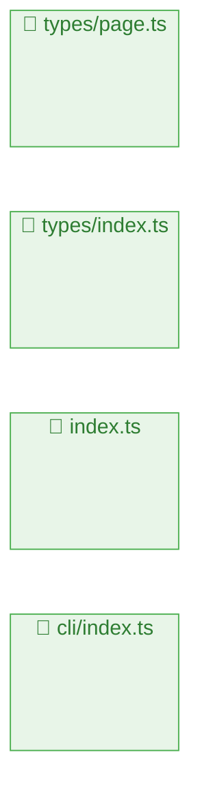

# ページ構造解析レポート

**生成日時**: 2025/6/13 9:36:03
**参照元**: `./src`

## 🚀 技術スタック

### 主要技術
- **言語**: TypeScript
- **フレームワーク**: Unknown
- **パッケージマネージャー**: npm

### 言語構成
- **TypeScript**: 100% (22ファイル)

### フレームワーク/ライブラリ

## 📊 統計情報

- **総ページ数**: 4
- **総コンポーネント数**: 0
- **解析時間**: 2ms

## 🗺️ プロジェクト構造図

