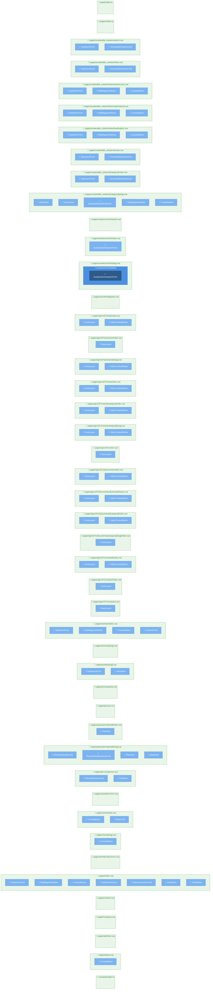

# ページ構造解析レポート

**生成日時**: 2025/6/13 8:57:35

## 📊 統計情報

- **総ページ数**: 46
- **総コンポーネント数**: 72
- **解析時間**: 22ms

## 🗺️ プロジェクト構造図

```mermaid
flowchart LR

%% ページ構造図

  subgraph page1 ["📄 constants/index.ts"]
    page1_placeholder[" "]
    style page1_placeholder fill:transparent,stroke:transparent
  end
  style page1 fill:#E8F5E8,stroke:#4CAF50,color:#2E7D32

  subgraph page2 ["📄 pages/about.vue"]
    page2_c0["🧩 ContactButton"]
    style page2_c0 fill:#7BB3F0,stroke:#4A90E2,color:#FFFFFF
  end
  style page2 fill:#E8F5E8,stroke:#4CAF50,color:#2E7D32

  subgraph page3 ["📄 pages/attention.vue"]
    page3_placeholder[" "]
    style page3_placeholder fill:transparent,stroke:transparent
  end
  style page3 fill:#E8F5E8,stroke:#4CAF50,color:#2E7D32

  subgraph page4 ["📄 pages/company.vue"]
    page4_placeholder[" "]
    style page4_placeholder fill:transparent,stroke:transparent
  end
  style page4 fill:#E8F5E8,stroke:#4CAF50,color:#2E7D32

  subgraph page5 ["📄 pages/contact.vue"]
    page5_placeholder[" "]
    style page5_placeholder fill:transparent,stroke:transparent
  end
  style page5 fill:#E8F5E8,stroke:#4CAF50,color:#2E7D32

  subgraph page6 ["📄 pages/index.vue"]
    page6_c0["🧩 TopSearchForm"]
    style page6_c0 fill:#7BB3F0,stroke:#4A90E2,color:#FFFFFF
    page6_c1["🧩 MailMagazineButton"]
    style page6_c1 fill:#7BB3F0,stroke:#4A90E2,color:#FFFFFF
    page6_c2["🧩 ContactButton"]
    style page6_c2 fill:#7BB3F0,stroke:#4A90E2,color:#FFFFFF
    page6_c3["🧩 TopNewArticleList"]
    style page6_c3 fill:#7BB3F0,stroke:#4A90E2,color:#FFFFFF
    page6_c4["🧩 TopAccessArticleCard"]
    style page6_c4 fill:#7BB3F0,stroke:#4A90E2,color:#FFFFFF
    page6_c5["🧩 ArticleItem"]
    style page6_c5 fill:#7BB3F0,stroke:#4A90E2,color:#FFFFFF
    page6_c6["🧩 TopSidebar"]
    style page6_c6 fill:#7BB3F0,stroke:#4A90E2,color:#FFFFFF
  end
  style page6 fill:#E8F5E8,stroke:#4CAF50,color:#2E7D32

  subgraph page7 ["📄 pages/membership-terms.vue"]
    page7_placeholder[" "]
    style page7_placeholder fill:transparent,stroke:transparent
  end
  style page7 fill:#E8F5E8,stroke:#4CAF50,color:#2E7D32

  subgraph page8 ["📄 pages/news/[slug].vue"]
    page8_c0["🧩 ContactButton"]
    style page8_c0 fill:#7BB3F0,stroke:#4A90E2,color:#FFFFFF
  end
  style page8 fill:#E8F5E8,stroke:#4CAF50,color:#2E7D32

  subgraph page9 ["📄 pages/news/index.vue"]
    page9_c0["🧩 ContactButton"]
    style page9_c0 fill:#7BB3F0,stroke:#4A90E2,color:#FFFFFF
    page9_c1["🧩 NewsCard"]
    style page9_c1 fill:#7BB3F0,stroke:#4A90E2,color:#FFFFFF
  end
  style page9 fill:#E8F5E8,stroke:#4CAF50,color:#2E7D32

  subgraph page10 ["📄 pages/newsletter-form.vue"]
    page10_placeholder[" "]
    style page10_placeholder fill:transparent,stroke:transparent
  end
  style page10 fill:#E8F5E8,stroke:#4CAF50,color:#2E7D32

  subgraph page11 ["📄 pages/pla-comparison.vue"]
    page11_c0["🧩 PlazukanBreadcrumb"]
    style page11_c0 fill:#7BB3F0,stroke:#4A90E2,color:#FFFFFF
    page11_c1["🧩 PlaSelect"]
    style page11_c1 fill:#7BB3F0,stroke:#4A90E2,color:#FFFFFF
  end
  style page11 fill:#E8F5E8,stroke:#4CAF50,color:#2E7D32

  subgraph page12 ["📄 pages/plazukan/material/[slug].vue"]
    page12_c0["🧩 PlazukanBreadcrumb"]
    style page12_c0 fill:#7BB3F0,stroke:#4A90E2,color:#FFFFFF
    page12_c1["🧩 PlazukanRelatedArticleCard"]
    style page12_c1 fill:#7BB3F0,stroke:#4A90E2,color:#FFFFFF
    page12_c2["🧩 PlaSelect"]
    style page12_c2 fill:#7BB3F0,stroke:#4A90E2,color:#FFFFFF
    page12_c3["🧩 Bookmark"]
    style page12_c3 fill:#7BB3F0,stroke:#4A90E2,color:#FFFFFF
  end
  style page12 fill:#E8F5E8,stroke:#4CAF50,color:#2E7D32

  subgraph page13 ["📄 pages/plazukan/material/index.vue"]
    page13_c0["🧩 PlaSelect"]
    style page13_c0 fill:#7BB3F0,stroke:#4A90E2,color:#FFFFFF
  end
  style page13 fill:#E8F5E8,stroke:#4CAF50,color:#2E7D32

  subgraph page14 ["📄 pages/privacy.vue"]
    page14_placeholder[" "]
    style page14_placeholder fill:transparent,stroke:transparent
  end
  style page14 fill:#E8F5E8,stroke:#4CAF50,color:#2E7D32

  subgraph page15 ["📄 pages/privacypolicy.vue"]
    page15_placeholder[" "]
    style page15_placeholder fill:transparent,stroke:transparent
  end
  style page15 fill:#E8F5E8,stroke:#4CAF50,color:#2E7D32

  subgraph page16 ["📄 pages/profile/[slug].vue"]
    page16_c0["🧩 TopSearchForm"]
    style page16_c0 fill:#7BB3F0,stroke:#4A90E2,color:#FFFFFF
    page16_c1["🧩 ArticleItem"]
    style page16_c1 fill:#7BB3F0,stroke:#4A90E2,color:#FFFFFF
  end
  style page16 fill:#E8F5E8,stroke:#4CAF50,color:#2E7D32

  subgraph page17 ["📄 pages/seminar/[slug].vue"]
    page17_placeholder[" "]
    style page17_placeholder fill:transparent,stroke:transparent
  end
  style page17 fill:#E8F5E8,stroke:#4CAF50,color:#2E7D32

  subgraph page18 ["📄 pages/seminar/index.vue"]
    page18_c0["🧩 TopSearchForm"]
    style page18_c0 fill:#7BB3F0,stroke:#4A90E2,color:#FFFFFF
    page18_c1["🧩 MailMagazineButton"]
    style page18_c1 fill:#7BB3F0,stroke:#4A90E2,color:#FFFFFF
    page18_c2["🧩 ContactButton"]
    style page18_c2 fill:#7BB3F0,stroke:#4A90E2,color:#FFFFFF
    page18_c3["🧩 SeminarCard"]
    style page18_c3 fill:#7BB3F0,stroke:#4A90E2,color:#FFFFFF
  end
  style page18 fill:#E8F5E8,stroke:#4CAF50,color:#2E7D32

  subgraph page19 ["📄 pages/sjpn1971/company.vue"]
    page19_c0["🧩 NuxtLayout"]
    style page19_c0 fill:#7BB3F0,stroke:#4A90E2,color:#FFFFFF
  end
  style page19 fill:#E8F5E8,stroke:#4CAF50,color:#2E7D32

  subgraph page20 ["📄 pages/sjpn1971/contact/index.vue"]
    page20_c0["🧩 NuxtLayout"]
    style page20_c0 fill:#7BB3F0,stroke:#4A90E2,color:#FFFFFF
  end
  style page20 fill:#E8F5E8,stroke:#4CAF50,color:#2E7D32

  subgraph page21 ["📄 pages/sjpn1971/contact/thanks.vue"]
    page21_c0["🧩 NuxtLayout"]
    style page21_c0 fill:#7BB3F0,stroke:#4A90E2,color:#FFFFFF
    page21_c1["🧩 SabicContactButton"]
    style page21_c1 fill:#7BB3F0,stroke:#4A90E2,color:#FFFFFF
  end
  style page21 fill:#E8F5E8,stroke:#4CAF50,color:#2E7D32

  subgraph page22 ["📄 pages/sjpn1971/documents/[category]/[slug]/index.vue"]
    page22_c0["🧩 NuxtLayout"]
    style page22_c0 fill:#7BB3F0,stroke:#4A90E2,color:#FFFFFF
  end
  style page22 fill:#E8F5E8,stroke:#4CAF50,color:#2E7D32

  subgraph page23 ["📄 pages/sjpn1971/documents/[category]/index.vue"]
    page23_c0["🧩 NuxtLayout"]
    style page23_c0 fill:#7BB3F0,stroke:#4A90E2,color:#FFFFFF
    page23_c1["🧩 SabicContactButton"]
    style page23_c1 fill:#7BB3F0,stroke:#4A90E2,color:#FFFFFF
  end
  style page23 fill:#E8F5E8,stroke:#4CAF50,color:#2E7D32

  subgraph page24 ["📄 pages/sjpn1971/documents/download/thanks.vue"]
    page24_c0["🧩 NuxtLayout"]
    style page24_c0 fill:#7BB3F0,stroke:#4A90E2,color:#FFFFFF
    page24_c1["🧩 SabicContactButton"]
    style page24_c1 fill:#7BB3F0,stroke:#4A90E2,color:#FFFFFF
  end
  style page24 fill:#E8F5E8,stroke:#4CAF50,color:#2E7D32

  subgraph page25 ["📄 pages/sjpn1971/documents/index.vue"]
    page25_c0["🧩 NuxtLayout"]
    style page25_c0 fill:#7BB3F0,stroke:#4A90E2,color:#FFFFFF
    page25_c1["🧩 SabicContactButton"]
    style page25_c1 fill:#7BB3F0,stroke:#4A90E2,color:#FFFFFF
  end
  style page25 fill:#E8F5E8,stroke:#4CAF50,color:#2E7D32

  subgraph page26 ["📄 pages/sjpn1971/index.vue"]
    page26_c0["🧩 NuxtLayout"]
    style page26_c0 fill:#7BB3F0,stroke:#4A90E2,color:#FFFFFF
  end
  style page26 fill:#E8F5E8,stroke:#4CAF50,color:#2E7D32

  subgraph page27 ["📄 pages/sjpn1971/news/[category]/[slug].vue"]
    page27_c0["🧩 NuxtLayout"]
    style page27_c0 fill:#7BB3F0,stroke:#4A90E2,color:#FFFFFF
    page27_c1["🧩 SabicContactButton"]
    style page27_c1 fill:#7BB3F0,stroke:#4A90E2,color:#FFFFFF
  end
  style page27 fill:#E8F5E8,stroke:#4CAF50,color:#2E7D32

  subgraph page28 ["📄 pages/sjpn1971/news/[category]/index.vue"]
    page28_c0["🧩 NuxtLayout"]
    style page28_c0 fill:#7BB3F0,stroke:#4A90E2,color:#FFFFFF
    page28_c1["🧩 SabicContactButton"]
    style page28_c1 fill:#7BB3F0,stroke:#4A90E2,color:#FFFFFF
  end
  style page28 fill:#E8F5E8,stroke:#4CAF50,color:#2E7D32

  subgraph page29 ["📄 pages/sjpn1971/news/index.vue"]
    page29_c0["🧩 NuxtLayout"]
    style page29_c0 fill:#7BB3F0,stroke:#4A90E2,color:#FFFFFF
    page29_c1["🧩 SabicContactButton"]
    style page29_c1 fill:#7BB3F0,stroke:#4A90E2,color:#FFFFFF
  end
  style page29 fill:#E8F5E8,stroke:#4CAF50,color:#2E7D32

  subgraph page30 ["📄 pages/sjpn1971/products/[slug].vue"]
    page30_c0["🧩 NuxtLayout"]
    style page30_c0 fill:#7BB3F0,stroke:#4A90E2,color:#FFFFFF
    page30_c1["🧩 SabicContactButton"]
    style page30_c1 fill:#7BB3F0,stroke:#4A90E2,color:#FFFFFF
  end
  style page30 fill:#E8F5E8,stroke:#4CAF50,color:#2E7D32

  subgraph page31 ["📄 pages/sjpn1971/products/index.vue"]
    page31_c0["🧩 NuxtLayout"]
    style page31_c0 fill:#7BB3F0,stroke:#4A90E2,color:#FFFFFF
  end
  style page31 fill:#E8F5E8,stroke:#4CAF50,color:#2E7D32

  subgraph page32 ["📄 pages/sjpn1971/trademark.vue"]
    page32_c0["🧩 NuxtLayout"]
    style page32_c0 fill:#7BB3F0,stroke:#4A90E2,color:#FFFFFF
    page32_c1["🧩 SabicContactButton"]
    style page32_c1 fill:#7BB3F0,stroke:#4A90E2,color:#FFFFFF
  end
  style page32 fill:#E8F5E8,stroke:#4CAF50,color:#2E7D32

  subgraph page33 ["📄 pages/socialmediapolicy.vue"]
    page33_placeholder[" "]
    style page33_placeholder fill:transparent,stroke:transparent
  end
  style page33 fill:#E8F5E8,stroke:#4CAF50,color:#2E7D32

  subgraph page34 ["📄 pages/sustaina-techo/[slug].vue"]
    subgraph page34_c0 ["🧩 SustainaTechoSideBar"]
      page34_c0_child1["🧩 SustainaTechoSearchForm"]
      style page34_c0_child1 fill:#2E5A8A,stroke:#1E3D5C,color:#FFFFFF
    end
    style page34_c0 fill:#4A90E2,stroke:#2E5A8A,color:#FFFFFF
  end
  style page34 fill:#E8F5E8,stroke:#4CAF50,color:#2E7D32

  subgraph page35 ["📄 pages/sustaina-techo/index.vue"]
    page35_c0["🧩 SustainaTechoSearchForm"]
    style page35_c0 fill:#7BB3F0,stroke:#4A90E2,color:#FFFFFF
  end
  style page35 fill:#E8F5E8,stroke:#4CAF50,color:#2E7D32

  subgraph page36 ["📄 pages/sustaina-techo/search.vue"]
    page36_placeholder[" "]
    style page36_placeholder fill:transparent,stroke:transparent
  end
  style page36 fill:#E8F5E8,stroke:#4CAF50,color:#2E7D32

  subgraph page37 ["📄 pages/sustainable_solution/[category]/[slug].vue"]
    page37_c0["🧩 ArticleItem"]
    style page37_c0 fill:#7BB3F0,stroke:#4A90E2,color:#FFFFFF
    page37_c1["🧩 NuxtLayout"]
    style page37_c1 fill:#7BB3F0,stroke:#4A90E2,color:#FFFFFF
    page37_c2["🧩 SustainableSolutionBanner"]
    style page37_c2 fill:#7BB3F0,stroke:#4A90E2,color:#FFFFFF
    page37_c3["🧩 MailMagazineButton"]
    style page37_c3 fill:#7BB3F0,stroke:#4A90E2,color:#FFFFFF
    page37_c4["🧩 ContactButton"]
    style page37_c4 fill:#7BB3F0,stroke:#4A90E2,color:#FFFFFF
  end
  style page37 fill:#E8F5E8,stroke:#4CAF50,color:#2E7D32

  subgraph page38 ["📄 pages/sustainable_solution/[category]/index.vue"]
    page38_c0["🧩 TopSearchForm"]
    style page38_c0 fill:#7BB3F0,stroke:#4A90E2,color:#FFFFFF
    page38_c1["🧩 SustainableSolutionCard"]
    style page38_c1 fill:#7BB3F0,stroke:#4A90E2,color:#FFFFFF
  end
  style page38 fill:#E8F5E8,stroke:#4CAF50,color:#2E7D32

  subgraph page39 ["📄 pages/sustainable_solution/access.vue"]
    page39_c0["🧩 TopSearchForm"]
    style page39_c0 fill:#7BB3F0,stroke:#4A90E2,color:#FFFFFF
    page39_c1["🧩 SustainableSolutionCard"]
    style page39_c1 fill:#7BB3F0,stroke:#4A90E2,color:#FFFFFF
  end
  style page39 fill:#E8F5E8,stroke:#4CAF50,color:#2E7D32

  subgraph page40 ["📄 pages/sustainable_solution/download/logistic.vue"]
    page40_c0["🧩 TopSearchForm"]
    style page40_c0 fill:#7BB3F0,stroke:#4A90E2,color:#FFFFFF
    page40_c1["🧩 MailMagazineButton"]
    style page40_c1 fill:#7BB3F0,stroke:#4A90E2,color:#FFFFFF
    page40_c2["🧩 ContactButton"]
    style page40_c2 fill:#7BB3F0,stroke:#4A90E2,color:#FFFFFF
  end
  style page40 fill:#E8F5E8,stroke:#4CAF50,color:#2E7D32

  subgraph page41 ["📄 pages/sustainable_solution/download/material.vue"]
    page41_c0["🧩 TopSearchForm"]
    style page41_c0 fill:#7BB3F0,stroke:#4A90E2,color:#FFFFFF
    page41_c1["🧩 MailMagazineButton"]
    style page41_c1 fill:#7BB3F0,stroke:#4A90E2,color:#FFFFFF
    page41_c2["🧩 ContactButton"]
    style page41_c2 fill:#7BB3F0,stroke:#4A90E2,color:#FFFFFF
  end
  style page41 fill:#E8F5E8,stroke:#4CAF50,color:#2E7D32

  subgraph page42 ["📄 pages/sustainable_solution/download/success.vue"]
    page42_c0["🧩 TopSearchForm"]
    style page42_c0 fill:#7BB3F0,stroke:#4A90E2,color:#FFFFFF
    page42_c1["🧩 MailMagazineButton"]
    style page42_c1 fill:#7BB3F0,stroke:#4A90E2,color:#FFFFFF
    page42_c2["🧩 ContactButton"]
    style page42_c2 fill:#7BB3F0,stroke:#4A90E2,color:#FFFFFF
  end
  style page42 fill:#E8F5E8,stroke:#4CAF50,color:#2E7D32

  subgraph page43 ["📄 pages/sustainable_solution/index.vue"]
    page43_c0["🧩 TopSearchForm"]
    style page43_c0 fill:#7BB3F0,stroke:#4A90E2,color:#FFFFFF
    page43_c1["🧩 SustainableSolutionCard"]
    style page43_c1 fill:#7BB3F0,stroke:#4A90E2,color:#FFFFFF
  end
  style page43 fill:#E8F5E8,stroke:#4CAF50,color:#2E7D32

  subgraph page44 ["📄 pages/sustainable_solution/search.vue"]
    page44_c0["🧩 TopSearchForm"]
    style page44_c0 fill:#7BB3F0,stroke:#4A90E2,color:#FFFFFF
    page44_c1["🧩 SustainableSolutionCard"]
    style page44_c1 fill:#7BB3F0,stroke:#4A90E2,color:#FFFFFF
  end
  style page44 fill:#E8F5E8,stroke:#4CAF50,color:#2E7D32

  subgraph page45 ["📄 plugins/index.ts"]
    page45_placeholder[" "]
    style page45_placeholder fill:transparent,stroke:transparent
  end
  style page45 fill:#E8F5E8,stroke:#4CAF50,color:#2E7D32

  subgraph page46 ["📄 types/index.ts"]
    page46_placeholder[" "]
    style page46_placeholder fill:transparent,stroke:transparent
  end
  style page46 fill:#E8F5E8,stroke:#4CAF50,color:#2E7D32

```