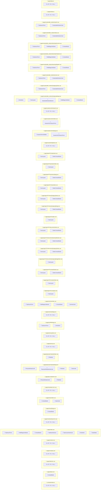

# ページ構造解析レポート

**生成日時**: 2025/6/13 8:40:58

## 📊 統計情報

- **総ページ数**: 46
- **総コンポーネント数**: 72
- **解析時間**: 24ms

## 🗺️ プロジェクト構造図

```mermaid
flowchart LR

%% ページ構造図

  subgraph page1 ["📄 constants/index.ts"]
    page1_empty["（コンポーネントなし）"]
  end

  subgraph page2 ["📄 pages/about.vue"]
    page2_c0["🧩 ContactButton"]
  end

  subgraph page3 ["📄 pages/attention.vue"]
    page3_empty["（コンポーネントなし）"]
  end

  subgraph page4 ["📄 pages/company.vue"]
    page4_empty["（コンポーネントなし）"]
  end

  subgraph page5 ["📄 pages/contact.vue"]
    page5_empty["（コンポーネントなし）"]
  end

  subgraph page6 ["📄 pages/index.vue"]
    page6_c0["🧩 TopSearchForm"]
    page6_c1["🧩 MailMagazineButton"]
    page6_c2["🧩 ContactButton"]
    page6_c3["🧩 TopNewArticleList"]
    page6_c4["🧩 TopAccessArticleCard"]
    page6_c5["🧩 ArticleItem"]
    page6_c6["🧩 TopSidebar"]
  end

  subgraph page7 ["📄 pages/membership-terms.vue"]
    page7_empty["（コンポーネントなし）"]
  end

  subgraph page8 ["📄 pages/news/[slug].vue"]
    page8_c0["🧩 ContactButton"]
  end

  subgraph page9 ["📄 pages/news/index.vue"]
    page9_c0["🧩 ContactButton"]
    page9_c1["🧩 NewsCard"]
  end

  subgraph page10 ["📄 pages/newsletter-form.vue"]
    page10_empty["（コンポーネントなし）"]
  end

  subgraph page11 ["📄 pages/pla-comparison.vue"]
    page11_c0["🧩 PlazukanBreadcrumb"]
    page11_c1["🧩 PlaSelect"]
  end

  subgraph page12 ["📄 pages/plazukan/material/[slug].vue"]
    page12_c0["🧩 PlazukanBreadcrumb"]
    page12_c1["🧩 PlazukanRelatedArticleCard"]
    page12_c2["🧩 PlaSelect"]
    page12_c3["🧩 Bookmark"]
  end

  subgraph page13 ["📄 pages/plazukan/material/index.vue"]
    page13_c0["🧩 PlaSelect"]
  end

  subgraph page14 ["📄 pages/privacy.vue"]
    page14_empty["（コンポーネントなし）"]
  end

  subgraph page15 ["📄 pages/privacypolicy.vue"]
    page15_empty["（コンポーネントなし）"]
  end

  subgraph page16 ["📄 pages/profile/[slug].vue"]
    page16_c0["🧩 TopSearchForm"]
    page16_c1["🧩 ArticleItem"]
  end

  subgraph page17 ["📄 pages/seminar/[slug].vue"]
    page17_empty["（コンポーネントなし）"]
  end

  subgraph page18 ["📄 pages/seminar/index.vue"]
    page18_c0["🧩 TopSearchForm"]
    page18_c1["🧩 MailMagazineButton"]
    page18_c2["🧩 ContactButton"]
    page18_c3["🧩 SeminarCard"]
  end

  subgraph page19 ["📄 pages/sjpn1971/company.vue"]
    page19_c0["🧩 NuxtLayout"]
  end

  subgraph page20 ["📄 pages/sjpn1971/contact/index.vue"]
    page20_c0["🧩 NuxtLayout"]
  end

  subgraph page21 ["📄 pages/sjpn1971/contact/thanks.vue"]
    page21_c0["🧩 NuxtLayout"]
    page21_c1["🧩 SabicContactButton"]
  end

  subgraph page22 ["📄 pages/sjpn1971/documents/[category]/[slug]/index.vue"]
    page22_c0["🧩 NuxtLayout"]
  end

  subgraph page23 ["📄 pages/sjpn1971/documents/[category]/index.vue"]
    page23_c0["🧩 NuxtLayout"]
    page23_c1["🧩 SabicContactButton"]
  end

  subgraph page24 ["📄 pages/sjpn1971/documents/download/thanks.vue"]
    page24_c0["🧩 NuxtLayout"]
    page24_c1["🧩 SabicContactButton"]
  end

  subgraph page25 ["📄 pages/sjpn1971/documents/index.vue"]
    page25_c0["🧩 NuxtLayout"]
    page25_c1["🧩 SabicContactButton"]
  end

  subgraph page26 ["📄 pages/sjpn1971/index.vue"]
    page26_c0["🧩 NuxtLayout"]
  end

  subgraph page27 ["📄 pages/sjpn1971/news/[category]/[slug].vue"]
    page27_c0["🧩 NuxtLayout"]
    page27_c1["🧩 SabicContactButton"]
  end

  subgraph page28 ["📄 pages/sjpn1971/news/[category]/index.vue"]
    page28_c0["🧩 NuxtLayout"]
    page28_c1["🧩 SabicContactButton"]
  end

  subgraph page29 ["📄 pages/sjpn1971/news/index.vue"]
    page29_c0["🧩 NuxtLayout"]
    page29_c1["🧩 SabicContactButton"]
  end

  subgraph page30 ["📄 pages/sjpn1971/products/[slug].vue"]
    page30_c0["🧩 NuxtLayout"]
    page30_c1["🧩 SabicContactButton"]
  end

  subgraph page31 ["📄 pages/sjpn1971/products/index.vue"]
    page31_c0["🧩 NuxtLayout"]
  end

  subgraph page32 ["📄 pages/sjpn1971/trademark.vue"]
    page32_c0["🧩 NuxtLayout"]
    page32_c1["🧩 SabicContactButton"]
  end

  subgraph page33 ["📄 pages/socialmediapolicy.vue"]
    page33_empty["（コンポーネントなし）"]
  end

  subgraph page34 ["📄 pages/sustaina-techo/[slug].vue"]
    page34_c0["🧩 SustainaTechoSideBar"]
    page34_c1["🧩 SustainaTechoSearchForm"]
  end

  subgraph page35 ["📄 pages/sustaina-techo/index.vue"]
    page35_c0["🧩 SustainaTechoSearchForm"]
  end

  subgraph page36 ["📄 pages/sustaina-techo/search.vue"]
    page36_empty["（コンポーネントなし）"]
  end

  subgraph page37 ["📄 pages/sustainable_solution/[category]/[slug].vue"]
    page37_c0["🧩 ArticleItem"]
    page37_c1["🧩 NuxtLayout"]
    page37_c2["🧩 SustainableSolutionBanner"]
    page37_c3["🧩 MailMagazineButton"]
    page37_c4["🧩 ContactButton"]
  end

  subgraph page38 ["📄 pages/sustainable_solution/[category]/index.vue"]
    page38_c0["🧩 TopSearchForm"]
    page38_c1["🧩 SustainableSolutionCard"]
  end

  subgraph page39 ["📄 pages/sustainable_solution/access.vue"]
    page39_c0["🧩 TopSearchForm"]
    page39_c1["🧩 SustainableSolutionCard"]
  end

  subgraph page40 ["📄 pages/sustainable_solution/download/logistic.vue"]
    page40_c0["🧩 TopSearchForm"]
    page40_c1["🧩 MailMagazineButton"]
    page40_c2["🧩 ContactButton"]
  end

  subgraph page41 ["📄 pages/sustainable_solution/download/material.vue"]
    page41_c0["🧩 TopSearchForm"]
    page41_c1["🧩 MailMagazineButton"]
    page41_c2["🧩 ContactButton"]
  end

  subgraph page42 ["📄 pages/sustainable_solution/download/success.vue"]
    page42_c0["🧩 TopSearchForm"]
    page42_c1["🧩 MailMagazineButton"]
    page42_c2["🧩 ContactButton"]
  end

  subgraph page43 ["📄 pages/sustainable_solution/index.vue"]
    page43_c0["🧩 TopSearchForm"]
    page43_c1["🧩 SustainableSolutionCard"]
  end

  subgraph page44 ["📄 pages/sustainable_solution/search.vue"]
    page44_c0["🧩 TopSearchForm"]
    page44_c1["🧩 SustainableSolutionCard"]
  end

  subgraph page45 ["📄 plugins/index.ts"]
    page45_empty["（コンポーネントなし）"]
  end

  subgraph page46 ["📄 types/index.ts"]
    page46_empty["（コンポーネントなし）"]
  end

```