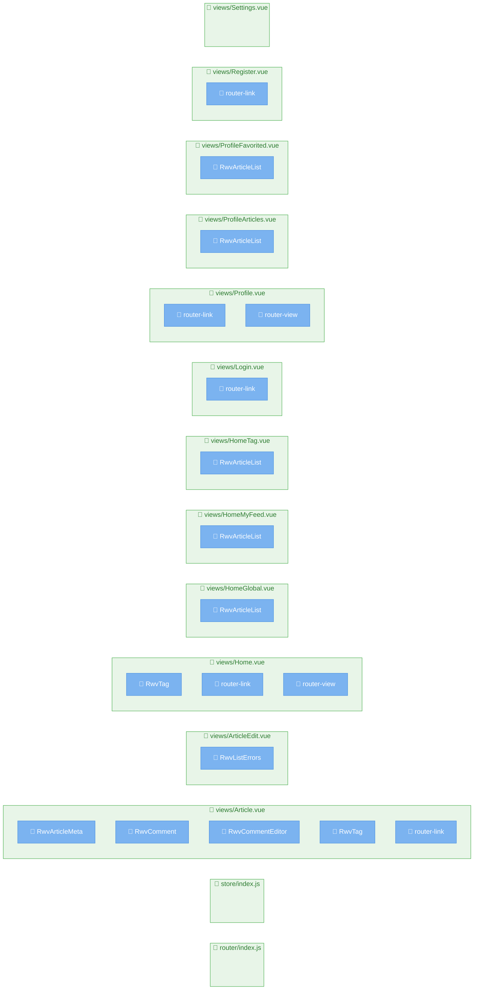

# ページ構造解析レポート

**生成日時**: 2025/6/13 9:35:41
**参照元**: [https://github.com/gothinkster/vue-realworld-example-app/tree/master/src](https://github.com/gothinkster/vue-realworld-example-app/tree/master/src)

## 🚀 技術スタック

### 主要技術
- **言語**: Vue.js
- **フレームワーク**: Unknown
- **パッケージマネージャー**: npm

### 言語構成
- **Vue.js**: 61% (25ファイル)
- **JavaScript**: 39% (16ファイル)

### フレームワーク/ライブラリ

## 📊 統計情報

- **総ページ数**: 14
- **総コンポーネント数**: 18
- **解析時間**: 3ms

## 🗺️ プロジェクト構造図

